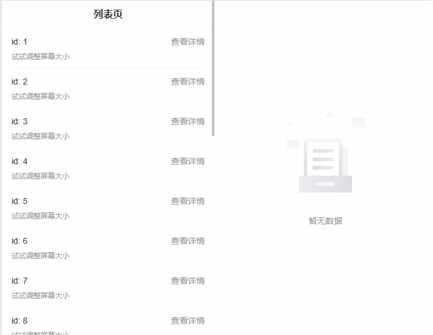
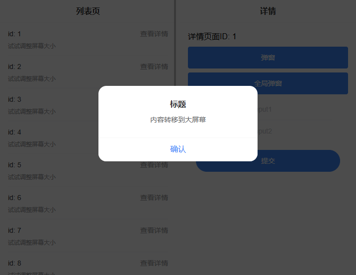

# 介绍

我们在开发一款移动端 H5 应用的时候，往往不会使用响应式设计（开发成本问题），转而使用类似于 px2rem 的方案进行适配。

这种方案很便利，但是也有一些问题：
 - 大屏幕上显示大字体（用户：我买折叠屏不是为了看更大的字体！！！）
 - 横屏下，不仅是字体内容更大，所能展示的信息密度也会缩水

基于这些痛点，同时为了保持快速开发，这里设计了一个基于 iframe 开发的响应式折叠屏原型。

## 资源共享

主屏幕和副屏幕使用的是同一个应用，因为是同一份代码，能够共享样式、组件和 UI 库。同时为了能够快速拉取资源，还可以使用 PWA 进行打包，这样主副屏可以共享同一个 Service Worker 进行资源来取。

## UI

框架通过 iframe 实现了主副屏之间的容器 UI 扩展：

- 响应式布局，在大屏幕模式下显示双屏，小屏幕模式下显示单屏
  
- 通过 window.top 绑定容器 UI，可跨屏幕进行全局展示。
  

## 路由拦截

实现自动的路由跳转机制：

- 自动识别可在副屏展示的路由（通过 meta.screen 配置）
- 在主屏幕点击后自动将详情页在副屏打开
- 屏幕尺寸变化时智能调整路由状态
  - 符合大屏时，副屏将主屏当前路由作为详情页打开，主屏回退到列表页
  - 符合小屏时，主屏将副屏路由作为新路由推入

## 响应式变化后，状态恢复

解决了屏幕尺寸变化后应用状态丢失的问题：

- 保证用户体验连贯性，避免状态丢失
- 使用 sessionStorage 保存页面状态（iframe内可共享）
- 在屏幕模式切换时自动恢复之前的浏览状态
- 不同 ID 的状态需隔离，同时需处理详情页 ID 相关的状态保存和恢复
